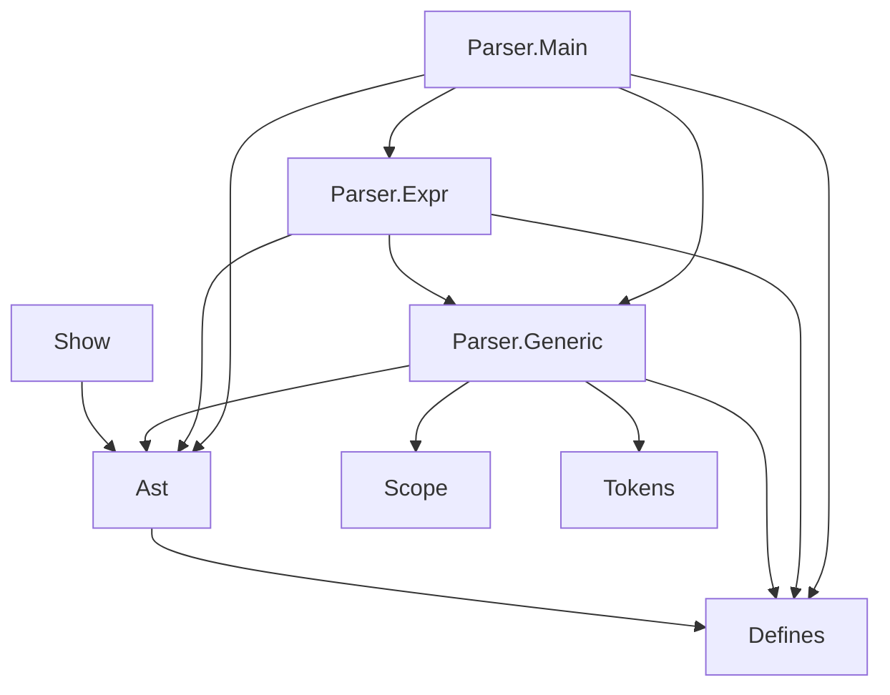

# Рефакторинг Qsp.FSharp.Core

Пришло время старый, четырехлетний код его отрефакторить, потому что без слез и жалости на него больно смотреть, но что самое худшее — его тяжело сопровождать.

Сейчас архитектура выглядит как-то так:

* `Qsp.Ast` — определение типов синтаксического дерева
* `Qsp.Defines` — определение предзаданных переменных, функций и процедур языка, а также их словесное описание, которое использует LSP. Сейчас является частью синтаксического дерева:

  ```fsharp
  and Expr =
      // ...
      | Func of Defines.PredefFunc PredefUndef * Expr list
  ```

* `Qsp.Parser.Scope` — система, которая помогает определить область видимости локальных переменных
* `Qsp.Tokens`
  * `TokenType` — тип, в котором перечисляются разновидности всевозможных токенов
  * `Range`
  * `InlineRange`
  * `Token` — `TokenType` + `InlineRange`
* `Qsp.Show` — переводит синтаксическое дерево в код
* `Qsp.Parser.Generic` — тут определено состояние парсера и куча всякой непонятной всячины
* `Qsp.Parser.Expr`
* `Qsp.Parser.Main`

## Диаграмма зависимостей



## AST

С `Qsp.Ast` всё понятно: оно находится на своем месте, к нему вопросов нет. Единственное, я бы его переименовал в `SyntaxTree`, потому что оно ни разу не абстрактное. Но пока махну рукой на это дело.

## Defines

<!-- todo -->

## Scope

Если думать наперед, то эта штука может использоваться в интерпретаторе. Делать я его, конечно, не буду, потому что для этого есть QSPLIB, но исключительно из таких соображений пускай он будет вне парсера.

## Show — AST to string

Если с парсером есть какие-то непонятки из-за белиберды, которую он порождает помимо дерева, то `Show` берет одно дерево и переводит его в string. Поэтому его нужно раскидать по следующему принципу:

* `Qsp.Ast.Expr.Show` — переводит `Expr` в строку
* `Qsp.Ast.Statement.Show` — `Statement` в строку
* `Qsp.Ast.Location.Show` — `Location` в строку
* и т.д. по синтаксическим типам

Можно в одном `Show.fs` файле пока держать.

## Parser — string to AST и не только

Если с `Show` всё понятно, то с Parser всё не так очевидно. Он представляет главную трудность в рефакторинге, потому что он помимо того, что строит дерево, он еще и обладает состоянием, в котором определены:

* сущности, которые использует Language Server:
  * `Tokens` — тип + `InlineRange` (т.е. номер строки и с какого символа ничанается токен, а каким заканчивается). Эта штука передается VS Code, а тот подсвечивает токены согласно их типам
  * Семантические ошибки, выявленные при первом проходе
  * `Hovers` — всплывающее подсказки по наведении курсора мышки в VS Code
  * `Highlights` — состояние подсветки. Эту штуку надо объединить с `Tokens`
  * `NotDefinedLocs` — здесь определяется список неопределенных локаций (ссылка на них есть, а самих локаций нет). Как это работает — ума не приложу
* прочее:
  * `IsEndOptional`
  * `LastSymbolPos` — ?

  Скорее всего, связаны друг с другом:

  * `PStmts` — какое-то непонятное хацканье
  * `SingleQuotNestedCount`
  * `DoubleQuotNestedCount`
  * `HtmlAttDoubleNested`

Было бы проще, если бы парсер генерировал только дерево, а все эти сущности, которые использует LSP, генерировались бы из него. А сейчас получается, что дерево используется только для форматирования кода, и из него толку никакого больше нет, сущности генерятся особняком, и я понятия не имею, что со всем этим делать.

Возможно, стоит раскидать парсер точно так же, тогда хоть какой-то просвет может наступить. Выглядеть это должно так:

* `Qsp.Ast.Parser` — здесь находится состояние и вспомогательные парсеры
* `Qsp.Ast.Expr.Parser` — здесь находится парсер, который на выходе дает `Expr`
* `Qsp.Ast.Statement.Parser` — здесь находится парсер, который на выходе дает `Statement`
* `Qsp.Ast.Location.Parser` — здесь находится парсер, который на выходе дает `Location`
* и т.д. по синтаксическим типам

А по файлам:

```text
parsers
├─ Parser.fs
├─ Expr.fs
├─ Statement.fs
├─ ...
└─ Location.fs
```

## Tokens

<!-- todo -->

## Итоговая структура

Итого по модулям получается такая структура:

```text
Qsp
  Scope
  Defines
  Ast
    Parser
      Range
      InlineRange
      TokenType
      Token
      State
      Common
    Expr
      Show
      Parser
    Location
      Show
      Parser
    ...
```

По файлам нечто такое:

```bash
root
├─ Scope.fs
├─ Defines.fs
├─ Ast.fs
├─ Show.fs
└─ Parsers
   ├─ Types.fs # Range, InlineRange, TokenType, Token, State
   ├─ Common.fs
   └─ Ast
      ├─ Expr.fs
      ├─ Statement.fs
      ├─ ...
      └─ Location.fs
```
