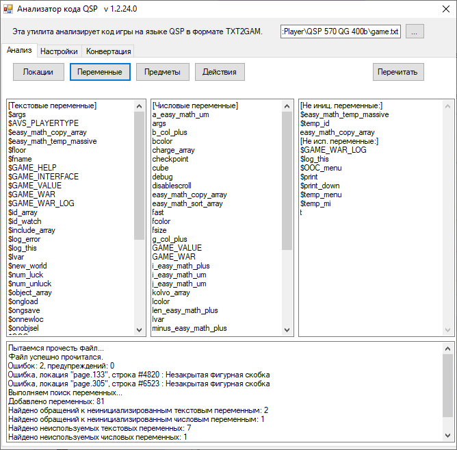
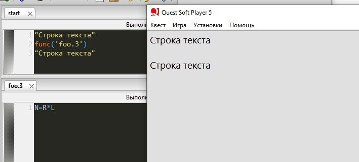
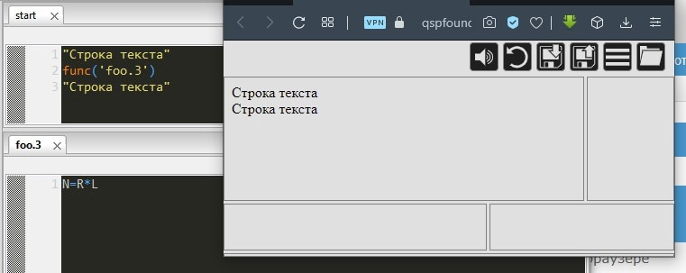
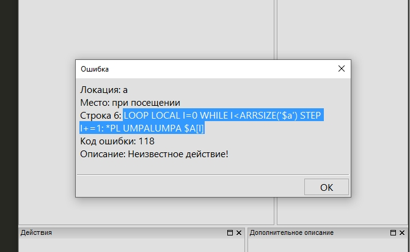

---
authors:
  - alex
tags:
  - документация
  - отличия версий
  - синтаксис
  - язык QSP
---

# Переход с QSP 5.7.0 на 5.9.x

Многие авторы, начинавшие разработку игр для плееров версии 5.7.0, боятся переводить проекты на более свежие версии из-за обилия изменений. Байт активно обновляет основную библиотеку QSP уже пять лет, и количество введённых изменений действительно может пугать.

Но на самом деле всё не так страшно.

Список по-настоящему критических изменений весьма скромен, и эта статья поможет безболезненно перевести проект на более новый и быстрый плеер.

Мы не будем подробно описывать все нововведения — они уже описаны в нескольких статьях. Сосредоточимся на практических шагах, попутно раскрывая наиболее значимые изменения в работе плеера по сравнению с версией 5.7.0.

Все нововведения уже отражены в онлайн-справке: [wiki.qsp.org](https://wiki.qsps.org)

Вот список статей, которые помогут более детально познакомиться со всеми изменениями: <!-- TODO: Перенести статьи на QSP Foundtion и изменить ссылки -->

- [https://vk.com/@qsplayer-novovvedeniya-v-qsp-580](https://vk.com/@qsplayer-novovvedeniya-v-qsp-580),
- [https://vk.com/@qsplayer-novovvedeniya-v-qsp-590](https://vk.com/@qsplayer-novovvedeniya-v-qsp-590),
- [https://vk.com/@qsplayer-chto-novogo-v-qsp-591](https://vk.com/@qsplayer-chto-novogo-v-qsp-591),
- [https://vk.com/@qsplayer-novovvedeniya-v-qsp-592-594](https://vk.com/@qsplayer-novovvedeniya-v-qsp-592-594).

## Инструменты

Для правки игры вам потребуются следующие инструменты:

1. **Утилита TXT2GAM** — конвертирует игру в формат текстового файла и обратно.

    - Скачать можно с [официального сайта](https://qsp.org/index.php?option=com_content&task=view&id=52&Itemid=56) или [со страницы релизов](https://github.com/QSPFoundation/txt2gam/releases) на GitHub.
    - Если не знаете, как пользоваться утилитой, прочитайте [краткое руководство](https://wiki.qsp.org/help:txt2gam).

2. **Анализатор QSP-кода** — быстро сканирует игру в формате текстового файла и предоставляет список возможных ошибок, имена переменных, локаций, действий, предметов и прочее.

    - Скачать можно по ссылке из [темы на форуме](https://qsp.org/index.php?option=com_agora&task=topic&id=365&Itemid=57), посвящённой Анализатору.
    - Или из архива на меге ["QSP/Программы"](https://mega.nz/folder/jXwXlSRJ#TF7P-soOJOWIC8MrBA-L1A). ← Смотрите папку "QSP-Analyser". Для первого раза лучше выбрать последнюю версию без модификаций.
    - Краткая информация доступна [на форуме](https://qsp.org/index.php?option=com_agora&task=topic&id=365&Itemid=57) и в [архиве статей](https://aleksversus.github.io/howdo_faq/docs/informarch/general/code_analyser).

3. Для просмотра игры в формате текстовых файлов подойдёт любой текстовый редактор. Рекомендуем Sublime Text или VS Code — они поддерживают подсветку синтаксиса QSP.

    - Для Sublime Text разработан [пакет](https://github.com/QSPFoundation/sublime_text_qsp_package), включающий плагин для работы с qsps-файлами и подсветку синтаксиса QSP.
    - Для VS Code существует [специальное расширение](https://github.com/QSPFoundation/Qsp.FSharp.VsCode).

Если вы используете системы контроля версий (например, Git), рекомендуем фиксировать каждое масштабное изменение в игре.

## Первый этап переноса. Критичные изменения

Версия библиотеки QSP 5.8.0 получила несколько критически значимых изменений, которые сломали обратную совместимость. Игра, написанная для плеера 5.7.0, иногда будет некорректно работать на плеерах версии 5.8.0 и выше.

Поправить такую игру достаточно легко.

:::warning [**Прежде всего!**]
Сделайте полную копию вашего проекта на тот случай, если что-то пойдёт не так.
:::

### Анализ кода игры для QSP 5.7.0

1. Сначала вам нужно сконвертировать игру в формат "qsps". Это делается с помощью утилиты txt2gam, или, если утилита подключена к Quest Generator, с помощью пункта меню "Экспорт → Текстовый файл формата TXT2GAM" в QGen.
   Формат "qsps" и "TXT2GAM" — это одно и то же.
2. Далее нужно запустить Анализатор и "скормить ему игру":
   - Запускаете утилиту и нажимаете кнопку с тремя точками в правом верхнем углу.
   - Находите и выбираете текстовый файл с вашей игрой.
   - Утилита автоматически запустит чтение файла и на вкладке "Анализ" в самом нижнем поле вы увидите список ошибок и предупреждений.
   - В той же вкладке нажмите кнопку "Переменные". В случае успешного чтения файла в трёх полях с полосами прокрутки отобразятся списки используемых в игре переменных.

Это всё, что понадобится нам от утилиты "Анализатор". Не закрывайте окно, вам понадобится информация из него.



### Разнотипные значения в массивах

Одно из самых масштабных изменений в QSP: больше нельзя хранить в одном массиве под одним индексом и числовое, и текстовое значение. Подробно это изменение описано в статье "[Массивы уже не те](https://vk.com/@qsplayer-massivy-uzhe-ne-te)" <!-- TODO: Перенести статью на foundation и заменить ссылку -->.

Если вы использовали старое поведение массивов как фичу (например, хранили названия и здоровье юнитов под одним индексом), в плеерах версии 5.8.0 и выше это сломает работу игры.

```qsp
! $unit - название, unit - здоровье
$unit[0] = "пехотинец" & unit[0] = 300
$unit[1] = "гвардеец" & unit[1] = 670
$unit[2] = "лучник" & unit[2] = 1500
$unit[3] = "артиллерист" & unit[3] = 10
```

В примере выше числовые значения затрут текстовые, а в плеерах версии 5.7.0 оба значения хранятся одновременно.

Решение простое. Чтобы починить игру, сломавшуюся из-за подобного использования массивов, мы конвертировали QSP-файл в текстовый формат и "скормили" его Анализатору.

Нужно сделать следующее:

1. Скопируйте списки текстовых и числовых переменных из соответствующих окошек Анализатора и сравните.

    - Можно, например, вставить эти списки в Excel, отсортировать по алфавиту и сопоставить вручную.

2. Если в обоих списках присутствуют одноимённые массивы (например, `$unit` и `unit`), переименуйте текстовые массивы во всей игре. (Для приведённого примера `$unit` можно переименовать в `$unit_name`.)
3. Массивы `$args`/`args` и `$result`/`result` переименовывать не нужно — это специальные массивы. Однако во всех локациях, где используются `$args`/`args`, первой строчкой обязательно проводите инициализацию (например, `args[9] = args[9]`), если используете текстовые индексы для элементов массива `$args`/`args`.
4. Будьте аккуратны с переименованием массивов, которые не используют одновременное хранения числовых и текстовых значений под одним индексом, но хранят значения обоих типов под разными индексами.

Когда не останется одноимённых текстовых и числовых массивов (за исключением выше обозначенных случаев), игра в плане хранения данных в массивах станет совместима и с плеерами версии 5.7.0, и с плеерами версий 5.8.0 и выше.

### Изменения в работе функций INSTR, ARRCOMP, ARRPOS

Необязательные аргументы функций **INSTR**, **ARRCOMP** и **ARRPOS** в плеерах 5.8.0 и выше переставлены в конец. В плеерах версии 5.7.0 и ниже эти аргументы шли в начале.

Например, в плеере 5.7.0 поиск подстроки в строке мог выглядеть так:

```qsp
instr(7, "В корзине 23 красных и 47 синих яблок.", "красн") & ! 14
```

Если вы полностью переходите на новые версии плеера и совместимость с версией 5.7.0 вас не волнует, найдите все вхождения `instr`, `arrcomp` и `arrpos` в игре и переставьте необязательный аргумент в конец:

```qsp
instr("В корзине 23 красных и 47 синих яблок.", "красн", 7) & ! 14
```

Если нужно сохранить совместимость с плеерами версии 5.7.0, сделайте следующее:

1. Проверьте значения необязательных аргументов. Если для `instr` эти значения везде равны `1`, а для `arrpos` и `arrcomp` — `0`, достаточно просто опустить эти значения, и игра в плане работы этих функций станет совместима и с 5.7.0, и с 5.8.0 и выше.
2. Если значения необязательных аргументов отличаются от указанных выше, напишите функции-обёртки для `instr`, `arrcomp` и `arrpos` и замените все встроенные функции QSP в игре на свои. Пример для функции `instr` ниже.

```qsps
# test
! будет работать во всех плеерах
func("myInstr", "В корзине 23 красных и 47 синих яблок.", "красн", 7) & ! 14
-- test

# myInstr
$args[0] = $args[0] & ! строка, по которой производим поиск
$args[1] = $args[1] & ! подстрока, которую ищем
args[2] = iif(args[2]>0, args[2], 1) & ! с какого элемента начинать поиск
if $QSPVER >= '5.8.0':
  result = instr($args[0], $args[1], args[2])
else:
  result = instr(args[2], $args[0], $args[1])
end
-- myInstr
```

Как видно из примера, в нашей функции мы всё равно изменили порядок аргументов, переставив необязательный аргумент в конец. Все строки с оригинальным `instr` придётся заменить на нашу функцию. Такое решение обеспечит совместимость и с плеерами версии 5.7.0, и с более новыми плеерами.

:::tip [Совет]
Поиск и замену этих функций удобнее всего делать в текстовом редакторе типа Sublime Text или VS Code — там можно использовать регулярные выражения для поиска и замены. Это избавит от ручной обработки каждого вхождения, и вы сможете в полуавтоматическом режиме заменить все сомнительные функции на исправленные за считанные минуты.
:::

### DISABLESUBEX не работает

Системная переменная, которая раньше отключала распознавание подвыражений, больше не работает.

Если раньше вы писали такой код:

```qsp
disablesubex = 1
'<<disablesubex>>'
disablesubex = 0
```

На экран без изменений выводилась строка "`<<disablesubex>>`". Подвыражение не раскрывалось.

Теперь переменная `DISABLESUBEX` больше не отключает раскрытие подвыражений, поэтому на экране вы увидите "`1`".

Чтобы вывести подвыражение на экран необработанным, используйте конкатенацию для разделения угловых скобок:

```qsp
'<'+'<disablesubex>>'
```

Эта правка сохранит совместимость с плеерами версии 5.7.0.

### ADDQST → INCLIB, KILLQST → FREELIB

В новых версиях плееров операторы `ADDQST` и `KILLQST` заменены на `INCLIB` и `FREELIB`.

Всё очень просто.

Переименуйте эти операторы, если не требуется сохранять совместимость с 5.7.0.

Если совместимость требуется, проверяйте версию плеера перед вызовом оператора:

```qsp
if $QSPVER >= '5.8.0':
  INCLIB 'my_lib.qsp'
else:
  ADDQST 'my_lib.qsp'
end
```

Работать всё будет одинаково — это те же самые операторы, просто переименованные.

### Изменения в работе логических операторов и функций

В QSP нет булевых значений (_`True`_ и _`False`_). В плеерах версии 5.7.0 вместо них использовались числа **`0`** и **`-1`**.

**`0`** означало _Ложь_ (_`False`_), а **`-1`** — _Правду_ (_`True`_). Соответственно все логические операции возвращали эти значения:

```qsp
! 5.7.0
*pl (3>2 and 4>3)  & ! -1
*pl (3>2 or 4>3)  & ! -1
*pl no 0      & ! -1
*pl (3<2 and 4>3)  & ! 0
*pl (3<2 or 4<3)  & ! 0
*pl no -1      & ! 0
```

Операторы `AND`, `OR`, `NO` были битовыми — они не просто сверяли истинность или ложность значений, а вычисляли их битовый результат:

```qsp
! 5.7.0
*pl (3 and 2) & ! 2
*pl (4 or 6)  & ! 6
*pl no 7      & ! -8
```

_В плеерах начиная с версии 5.8.0 операции сравнения, логические операторы и функции можно полноправно назвать _логическими_.

`AND`, `OR` и `NO` теперь всегда возвращают числовые значения **`0`** (эквивалент _`False`_) или **`1`** (эквивалент _`True`_). То же самое и с операциями сравнения.

```qsp
! >= 5.8.0
*pl (3>2 and 4>3)  & ! 1
*pl (3>2 or 4>3)  & ! 1
*pl no 0      & ! 1
*pl (3<2 and 4>3)  & ! 0
*pl (3<2 or 4<3)  & ! 0
*pl no 1      & ! 0

*pl (3 and 2) & ! 1
*pl (4 or 6)  & ! 1
*pl no 7      & ! 0
```

Обратите внимание: и в старых, и в новых версиях плееров **ЛЮБОЕ** число, отличное от нуля, воспринимается как _`True`_. Только **`0`** является эквивалентом _`False`_. Когда логический оператор получает любое отличное от нуля число в качестве операнда, он работает с ним, как если бы это была единица. Поэтому **`no 7`** возвращает **`0`**, что более правильно, чем в 5.7.0.

Логические функции `ISNUM`, `LOC`, `ISPLAY` и другие раньше возвращали **`-1`** как эквивалент _`True`_ и **`0`** как эквивалент _`False`_. Начиная с версии 5.8.0 они возвращают **`1`** и **`0`** соответственно, как и операции сравнения.

```qsp
isnum('123') & ! 1
isnum('12d') & ! 0
```

Операция `OBJ`, которая в плеерах версии 5.7.0 возвращала **`-1`** при наличии предмета в окне предметов, претерпела изменения.

В плеерах начиная с версии 5.8.0 она, как и прочие логические функции, стала возвращать **`1`** или **`0`**. Однако начиная с версии 5.9.4 она возвращает **ЧИСЛО** предметов с указанным названием в инвентаре.

```qsp
addobj 'Отвёртка'
addobj 'Отвёртка'
addobj 'Отвёртка'

*pl OBJ('Отвёртка') & ! в 5.7.0 ===> -1
                    & ! в 5.8.0 ===> 1
                    & ! в 5.9.0 ===> 3
```

Как видно, в QSP произошло много изменений в логических операторах и функциях, и всё это может повлиять на работоспособность игры.

К сожалению, так же быстро и просто пофиксить всё это, как массивы, не получится, однако ничего принципиально сложного в исправлении не требуется.

Если вы использовали побитовые операции в игре именно для вычислений каких-то значений, а не просто для проверки условий, вам придётся либо остаться на 5.7.0, либо написать собственные локации-функции, имитирующие побитовые операции.

Если вы просто использовали `OR`, `AND`, `NO` для проверки условий, ничего исправлять не нужно — всё продолжит работать так же, как работало раньше.

Чтобы сохранить совместимость с 5.7.0 и более новыми плеерами, уберите явное сравнение с **`-1`** для логических функций.

Пример:

```qsp
! совместимо только с плеерами версии 5.7.0
:input_age
$age = $input('Сколько вам лет?')
if isnum($age) = -1:
  hero_age = val($age)
else:
  jump 'input_age'
end
```

```qsp
! совместимо с плеерами любых версий
:input_age
$age = $input('Сколько вам лет?')
if isnum($age):
  hero_age = val($age)
else:
  jump 'input_age'
end
```

Также следует учесть, что в плеерах версии 5.7.0 (и ниже) у функций **`LOC`** и **`OBJ`** приоритет был ниже, чем у операций сравнения. Это могло быть неочевидным для выражений такого рода:

```qsp
(obj 'Отвёртка' = obj 'Верёвка')
```

Кажется, что это выражение должно выполняться так: проверяется наличие предмета "_Отвёртка_", проверяется наличие предмета "_Верёвка_", и лишь потом значения сравниваются. Однако в 5.7.0 у операции сравнения приоритет выше, чем у **OBJ**. Поэтому сначала выполняется операция сравнения, и лишь потом функция **OBJ**. Таким образом в плеерах версии 5.7.0 это выражение всегда возвращает **0**.

Начиная с версии 5.8.0 приоритет для `LOC` и `OBJ` стал таким же, как и для других функций типа `isnum` и `isplay`, из-за чего некоторые сложные условия могут теперь работать неправильно. Чтобы исправить это и сохранить совместимость со всеми версиями плееров, расставьте скобки во всех условиях с такими функциями:

```qsp
if (obj 'Отвёртка') = (obj 'Верёвка'):
  ...
```

Это будет прочитано одинаково и в плеере версии 5.7.0, и в плеерах версий 5.8.0 и выше.

### Аргумент по умолчанию для функции RAND

В плеерах версии 5.7.0 и ниже второй параметр функции **`RAND`** по умолчанию был **`0`**. Например, если вы указывали число **`100`** в качестве аргумента функции **`RAND`**, она возвращала случайное число от **`0`** до **`100`**. В плеерах версии 5.8.0 и выше, а также в _Quest Navigator_, второй параметр по умолчанию равен **`1`**. То есть если вы укажете лишь одно число, например **`100`**, функция **`RAND`** вернёт случайное значение от **`1`** до **`100`**.

Чтобы избежать багов в более новых версиях плееров и сохранить совместимость с плеерами версии 5.7.0, явно укажите второй аргумент:

```qsp
! вместо:
RAND(100)
! пишем:
RAND(0, 100)
```

В текстовых редакторах типа VS Code и Sublime Text это легко делается с помощью регулярных выражений.

### Изменения в работе неявного оператора

Неявный оператор — это оператор, который мы не указываем. В 5.7.0 он делал примерно то же, что оператор **`*pl`** — выводил на экран значение, добавляя после него перевод строки:

```qsp
! работает в плеерах любых версий  
*pl 456  
*pl "text"

! эквивалентно:

456 & ! здесь для вывода используется неявный оператор  
"text" & ! и здесь для вывода используется неявный оператор
```

Если мы вызывали какую-то функцию, но она не возвращала результат, неявный оператор, как и оператор **`*pl`**, выводил на экран пустую строку и добавлял к ней перевод строки:



Начиная с версии 5.8.0, если функция не возвращает значение, неявный оператор будет просто игнорировать такую функцию.



Чтобы исправить это и сохранить совместимость с плеерами версии 5.7.0, вместо неявного оператора везде напишите явный оператор **`*pl`**.

```qsp
*pl "Строка текста"
*pl func('foo.3')
*pl "Строка текста"
```

### Изменения в чтении длинных строк кода, разбитых на несколько

Чтобы разбивать длинные строки на несколько (для удобства чтения), в QSP используется сочетание символов "` _`" (пробел и символ нижнего подчёркивания).<!-- markdownlint-disable-line MD038 -->
В плеерах версии 5.7.0 и ниже при разборе этой конструкции движок оставлял строки как есть. Для примера возьмём такую конструкцию:

```qsp
if t _  
   or _  
   t:
```

В плеерах версии 5.7.0 символы преформатирования будут исключены при интерпретации, а строка, разбитая с помощью "` _`", будет объединена как есть, то есть будет равнозначна строке: <!-- markdownlint-disable-line MD038 -->

```qsp
if tort:
```

В плеерах версии 5.8.0 и выше эта строка будет объединена с добавлением пробела вместо каждого сочетания "` _`", то есть будет равнозначна строке: <!-- markdownlint-disable-line MD038 -->

```qsp
if t or t:
```

Унифицировать поведение для всех версий плееров очень легко — достаточно перед "` _`" поставить дополнительный пробел, то есть в конце строки должно получиться "`  _`" (два пробела и символ подчёркивания). <!-- markdownlint-disable-line MD038 -->

### Небольшое резюме по критическим изменениям

Как видно, все критические несовместимости при переходе на новые версии плееров легко исправляются так, чтобы работать и на старых, и на новых версиях. Да, придётся потратить прилично времени, если у вас большая игра, но в целом здесь нет ничего сложного.

Мы предложили варианты с сохранением совместимости для тех, кто хочет продолжать писать игры на 5.7.0, но при этом запускать их на последних версиях QSP. Однако настоятельно рекомендуем подумать над тем, чтобы полностью перевести игру на плееры последних версий с потерей совместимости со старыми плеерами — новые версии QSP обзавелись множеством новых фич, которые не только делают код более читаемым, но и облегчают разработку и ускоряют различные процессы в играх.

## Синтаксический сахар, циклы и прочее

В этом разделе рассмотрим различные изменения синтаксиса, упрощения, новые циклы и многое другое, что облегчит и сделает более читаемым ваш код.

Применение любого из этих нововведений сделает ваши игры несовместимыми со старыми версиями плееров, поэтому считайте, что для использования каждой новой фичи вам потребуется самая последняя версия QSP. На момент написания этой статьи это 5.9.5.

### Множественное присваивание

Множественное присваивание позволяет, используя одну операцию, присвоить значения сразу нескольким переменным.

Вместо:

```qsp
mass=45 & daz=65 & zaz=79
```

Теперь можно писать:

```qsp
mass, daz, zaz = 45, 65, 79
```

Как видно, множественное присваивание делает код более читаемым.

Также множественное присваивание позволяет поменять местами значения в двух переменных без использования третьей. Например, раньше было так:

```qsp
temp = new
new = old
old = temp
```

Теперь это делается одной строчкой:

```qsp
new, old = old, new
```

Множественное присваивание работает и с оператором **`SET`**:

```qsp
set mass, daz, zaz = 45, 65, 79
```

### Новый тип значения "_кортеж_"

Кортеж — это такой тип значения, в котором можно хранить несколько значений другого типа. Например, можно упаковать в кортеж два числовых и одно строковое значение:

```qsp
%pers = [187, 26, 'Петя']
```

Как видно из примера, для кортежей введён специальный префикс типа "**`%`**". Кортежи — это новый полноценный тип данных (например кортеж `%A`), наравне со строками (`$A`) и числовым типом (`A`).

Поскольку кортежи — это отдельный тип данных, вы можете вкладывать одни кортежи в другие:

```qsp
%unit = ['лучник', [123, 90], [234, 300], 'агрессивен']
```

Вот ещё несколько примеров создания кортежей:

```qsp
%q = [4, 6, 7]  
%q = ['sdfsd', 6]  
%q = [34]  
%q = [] & ! пустой кортеж  
%q = [56, [32,'sdsd'], 3]
```

Можно не только помещать данные в кортеж, но и извлекать их обратно. Процесс размещения данных в кортеже называется _упаковка_, а извлечение данных из кортежа — _распаковка_.

```qsp
! упаковка:
%q = [56, [32,'sdsd'], 3]
! распаковка:  
a, %b, c = %q
```

Подробнее о кортежах читайте на нашей вики: [wiki.qsp.org/кортежи](https://wiki.qsp.org/help:tuples).

### Многомерные массивы

Чтобы организовать многомерный массив, в плеерах версии 5.7.0 (и более ранних) приходилось использовать текстовые индексы. Например:

```qsp
! работает в плеерах любых версий:  
$unit_coords["3,1"]="Пехотинец"  
$unit_coords["2,7"]="Артиллерист"  
$unit_coords["10,0"]="Танк"
```

В новых версиях плеера (начиная с 5.8.0 и выше) можно не использовать текстовые индексы, а указывать несколько нужных значений через запятую:

```qsp
! версия 5.8.0 и выше  
$unit_coords[3,1]="Пехотинец"  
$unit_coords[2,7]="Артиллерист"  
$unit_coords[10,0]="Танк"
```

Это намного упрощает работу с многомерными массивами, при этом вы можете работать и с текстовыми индексами.

Многомерный индекс на самом деле является кортежем, просто мы опускаем вторые квадратные скобки:

```qsp
! многомерный массив:
$map[1,2] = 'space'
$map[1,3] = 'space'
$map[5,7] = 'tree'
$map[0,-1] = 'hero'
*pl $map[x,y]
 
! можно, но не рекомендуется,
! писать так:
$map[[1,2]] = 'space'
$map[[1,3]] = 'space'
$map[[5,7]] = 'tree'
$map[[0,-1]] = 'hero'
*pl $map[[x,y]]
```

Поскольку многомерный индекс — это кортеж, его значение можно хранить в переменной:

```qsp
%coords = [0, 3, -19]
$map[%coords] = 'hero'
```

### Локальные переменные, оператор local

В плеерах версии 5.8.0 и выше появился новый оператор, который позволяет объявить указанные переменные локальными для отдельного блока кода (локации, действия, циклы, код в **`DYNAMIC`**/**`DYNEVAL`**). После выполнения блока кода значения переменных восстанавливаются к предыдущим:


Можно объявить локальную переменную и сразу присвоить ей значение:

```qsp
local i=45
```

Можно объявить сразу несколько локальных переменных:

```qsp
! объявляем локальные переменные  
local i, j, k

! объявляем локальные переменные и присваиваем им значения  
local f, d, $g = 123, 45, 'string'
```

Подробнее про локальные переменные написано в [справке](https://wiki.qsp.org/help:variables).

### Приведение всех типов данных к булевому типу

Теперь не только числовые значения могут использоваться как условные _`True`_ и _`False`_, но также и строки, и кортежи.

- Любое число, отличное от нуля считается _`True`_, а ноль — _`False`_;
- Любая непустая строка считается _`True`_, а пустая — _`False`_;
- Любой непустой кортеж считается _`True`_ (даже кортеж содержащий пустой кортеж, или пустую строку), а пустой — _`False`_;

См. также подраздел "Правда или Ложь?" в [справке](https://wiki.qsp.org/help:expressions).

### Циклы

Долгое время циклы в QSP приходилось делать костыльным способом с использованием меток. Сейчас в QSP есть настоящие циклы, которые работают быстрее циклов на метках и гораздо лучше читаются.

Циклам посвящена отдельная [статья в справке](https://wiki.qsp.org/help:cycle), поэтому мы не будем останавливаться на знакомстве с синтаксисом, а просто посмотрим, как циклы писались раньше и как они пишутся сейчас.

```qsp
! заполнение массива значениями

! 5.7.0
i = 0
:loop
if i < 10:
  mass[i] = i
  i += 1
  jump 'loop'
end

! 5.8.0 и выше
loop local i = 0 while i < 10 step i += 1:
  mass[i] = i
end
```

Обратите внимание: счётчик цикла объявлен как локальная переменная. Он будет существовать только внутри цикла. Больше не нужно следить за значениями счётчика, как это было раньше.

```qsp
! Проверка ввода имени игроком

! 5.7.0
:name_enter
$name = $input('Как вас зовут?')
if $name = '': jump 'name_enter'

! 5.8.0 и выше
loop while no $name: $name = $input('Как вас зовут?')
```

Подсчёт числа предметов с указанным названием в инвентаре:

```qsp
$item = 'Отвёртка'

! 5.7.0
counter = 0

i = countobj()
:for
if i:
  if $getobj(i) = $item: counter += 1
  i -= 1
  jump 'for'
end

! 5.8.0 и выше
counter = 0

loop local i = countobj() while i step i -= 1:
  if $getobj(i) = $item: counter += 1
end
```

### Доступ к `ARGS` локаций в гиперссылках

Массив `ARGS` — это специальный массив, который заново создаётся на каждой локации. На каждой локации существует свой собственный массив `ARGS`, и значения в этом массиве не пересекаются со значениями массивов `ARGS`, созданных на других локациях. Более того, собственный уникальный массив `ARGS` создаётся и в выполняемых с помощью `DYNAMIC`/`DYNEVAL` блоках кода.

Этот массив заполняется значениями из переданных в код аргументов, начиная с элемента под номером `0`.

Если с массивами `ARGS` в коде локаций, вызываемых по `GOSUB` и `FUNC`, а также с массивами `ARGS` в коде, выполняемом с помощью `DYNAMIC` и `DYNEVAL`, всё понятно — эти массивы существуют только пока выполняется код, а потом уничтожаются, то с массивами `ARGS` в коде локаций, на которые был осуществлён переход с помощью `GOTO` или `XGOTO`, не всё так однозначно.

Технически такая локация продолжает выполняться, и массив `ARGS` продолжает существовать, пока игрок не покинет локацию.

Изначально доступ к этому массиву мы могли получить только внутри действий, теперь массив `ARGS` стал доступен и из кода гиперссылок.

Это не только позволяет учитывать в гиперссылках, какие данные были переданы на локацию, но и использовать `ARGS` как "сессионную" локальную переменную, существующую только во время сессии пребывания на локации.

Так мы можем, например, помещать в `ARGS` многострочный код в виде текста, а потом выполнять его из ссылки с помощью `DYNAMIC`.

```qsp
$args[21] = {
  if no деньги<100:
    addobj 'Кружка имбирного эля'
    кружка_эля += 1
    деньги -= 100
    *pl "Я приобрёл кружку имбирного эля."
  else
     *pl "Мне не хватает денег на эль."
  end
}
*pl "<a href='exec:dynamic $args[21]'>Купить кружку имбирного эля</a>"
```

Подробнее об аргументах, передаваемых на локации при переходе, читайте в разделе ["Переходы"](https://wiki.qsp.org/help:goto) справки.

### Неявный вызов пользовательских функций и процедур

Это синтаксический сахар над функцией **`FUNC`** и оператором **`GOSUB`**, который сильно упрощает написание и чтение кода.

Вот как раньше выглядел такой код:

```qsp
! код в формате QSPS/TXT2GAM
# start
gosub 'proceed'
*pl func('foo.3', 23, 45)
-- start

# proceed
act 'ДЕЙСТВИЕ':
  *pl func('foo.3', 12, 12)
end
-- proceed

# foo.3
$result = args[0]*args[1]/(args[0]+args[1])
-- foo.3
```

Здесь мы явно прописывали и оператор **`GOSUB`**, и функцию **`FUNC`**, что немного усложняло чтение кода.

Теперь мы не указываем оператор **`GOSUB`** явно, а пишем `@@`, затем сразу без пробелов — название локации, потом ставим пробел и, если нужно, перечисляем аргументы через запятую. Для нашего примера это выглядит так:

```qsp
@@proceed
```

Если бы нам нужно было передать, скажем, три аргумента, это бы выглядело так:

```qsp
@@proceed 'text', 23, $var
```

То же самое с **`FUNC`**, только запись немного отличается. Вместо `@@` мы пишем просто `@`, затем сразу без пробелов название локации, затем сразу без пробелов открываем скобки и перечисляем необходимые аргументы через запятую. Вот как это будет выглядеть в нашем примере:

```qsp
@foo.3(23, 45)
```

Таким образом мы существенно сокращаем запись вызовов собственных функций и процедур.

```qsp
! код в формате QSPS/TXT2GAM
# start
@@proceed
*pl @foo.3(23, 45)
-- start

# proceed
act 'ДЕЙСТВИЕ':
  *pl @foo.3(12, 12)
end
-- proceed

# foo.3
$result = args[0]*args[1]/(args[0]+args[1])
-- foo.3
```

Подробнее об этом нововведении можно прочитать в разделе ["Пользовательские функции и процедуры"](https://wiki.qsp.org/help:organizing) справки.

### Больше аргументов для локаций и функций

Теперь можно передавать до двадцати аргументов локациям и функциям.

Кроме встроенных функций **`MAX`** и **`MIN`**, ни одна другая функция или оператор не принимают такое количество аргументов.

Если говорить о локациях, то при работе с ними мы используем операторы **`GOSUB`**, **`GOTO`**, **`XGOTO`** и другие, а также функцию **`FUNC`**, и при передаче аргументов всегда нужно учитывать, что одним из аргументов является название локации. Для оператора **`DYNAMIC`** или функции **`DYNEVAL`** первым аргументом является текст выполняемого кода. То есть в данном случае мы можем передавать в код локации или "динамика" не более девятнадцати аргументов.

Помимо прочего, если мы создаём кортеж, мы не можем перечислить в квадратных скобках более двадцати значений. Если вам нужен более длинный кортеж, создавайте его частями, а части объединяйте с помощью операции **`&`** (конкатенация):

```qsp
%tpl = [1, 2, 3, 4, 5, 6, 7, 8, 9, 10, 11, 12, 13, 14, 15, 16, 17, 18, 19, 20]
%tpl = (%tpl & [21, 22, 23])
```

### Усовершенствование killvar

Теперь `KILLVAR` может уничтожать элемент массива по строковому индексу или кортежу.

```qsp
! удаление по числовому индексу
killvar 'яблоко',3
! удаление элемента по строковому индексу
killvar '$item_loc','палка'
! удаление элемента по многомерному индексу
killvar '$space',[0,-2,9]
```

### Комментарии после двоеточий в многострочных операторах

После двоеточия в многострочном условии, цикле или действии можно сразу записывать комментарий. В этом случае амперсанд не нужен, разделителем служит именно двоеточие:

```qsp
act "Взять яблоко": ! многострочное действие
    addobj "Яблоко"
    яблоко += 1
end
```

### Улучшение сообщений об ошибках

Сообщения об ошибках стали более информативны. Теперь они не только показывают номер строки с ошибкой, но и её содержимое.



### Поддержка многострочности внутри круглых и квадратных скобок

```qsp
%test = [
  [ 'key1', 'value1' ],
  [ 'key2', 'value2' ],
  [ 'key3', 'value3' ],
]

max(
  'val1',
  'val2',
  'val3',
  'val4'
)

pl (a +
  (b * 2) -
  (c + 2)
 ) * 2

$arr[
  'key1',
  'key2',
  $key3
] = 'value'

pl $arr['key1',
  'key2',
  $key3]

if ($color = "жёлтый" or
$color = "красный" or
$color = "зелёный"): "По-прежнему однострочное условие."
```

## Список новых операторов и функций, а также новые возможности старых

- [`ARRITEM`](https://dev.qsp.org/ru/docs/language/qsp-keywords/qsp-keywords-functions#arritem) — возвращает значение элемента массива под указанным индексом.
- [`SCANSTR`](https://dev.qsp.org/ru/docs/language/qsp-keywords/qsp-keywords-statements#scanstr) — поиск в строке непересекающихся вхождений, соответствующих шаблону, и помещение этих вхождений в массив.
- [`SORTARR`](https://dev.qsp.org/ru/docs/language/qsp-keywords/qsp-keywords-statements#sortarr) — сортировка указанного массива.
- [`$CUROBJS`](https://dev.qsp.org/ru/docs/language/qsp-keywords/qsp-keywords-functions#curobjs) — возвращает список выведенных на экран предметов в виде QSP-кода.
- [`SETVAR`](https://dev.qsp.org/ru/docs/language/qsp-keywords/qsp-keywords-statements#setvar) — присваивает значение переменной или ячейке массива.
- [`ARRTYPE`](https://dev.qsp.org/ru/docs/language/qsp-keywords/qsp-keywords-functions#arrtype) — возвращает тип значения, хранящегося в переменной, или указанной ячейке массива.
- [`ARRPACK`](https://dev.qsp.org/ru/docs/language/qsp-keywords/qsp-keywords-functions#arrpack) — упаковывает массив в кортеж.
- [`UNPACKARR`](https://dev.qsp.org/ru/docs/language/qsp-keywords/qsp-keywords-statements#unpackarr) — распаковка кортежа в указанный массив.
- [`RAND`](https://dev.qsp.org/ru/docs/language/qsp-keywords/qsp-keywords-functions#rand) — возвращает случайное число между двумя указанными числами. **Добавлен новый параметр: _Мода_**.
- [`REPLACE`](https://dev.qsp.org/ru/docs/language/qsp-keywords/qsp-keywords-functions#replace) — замена текста в строке. **Добавлен новый параметр: _Число замен_**.
- [`DELOBJ`](https://dev.qsp.org/ru/docs/language/qsp-keywords/qsp-keywords-statements#delobj) — удаление предмета из инвентаря по названию (если такой предмет существует).  **Добавлен новый параметр: _Число удаляемых предметов_**.
- `MODOBJ`, `RESETOBJ` — управление отображением предметов на экране

## Заключение

Как видно, несмотря на обилие произошедших за последние пять лет изменений, перенести проект на плеер самой последней версии не составит большого труда. Да, это потребует внимательности и понимания, чем занимался ваш код всё это время, но новые возможности того стоят.

Успехов в творчестве, и релиза без багов!
