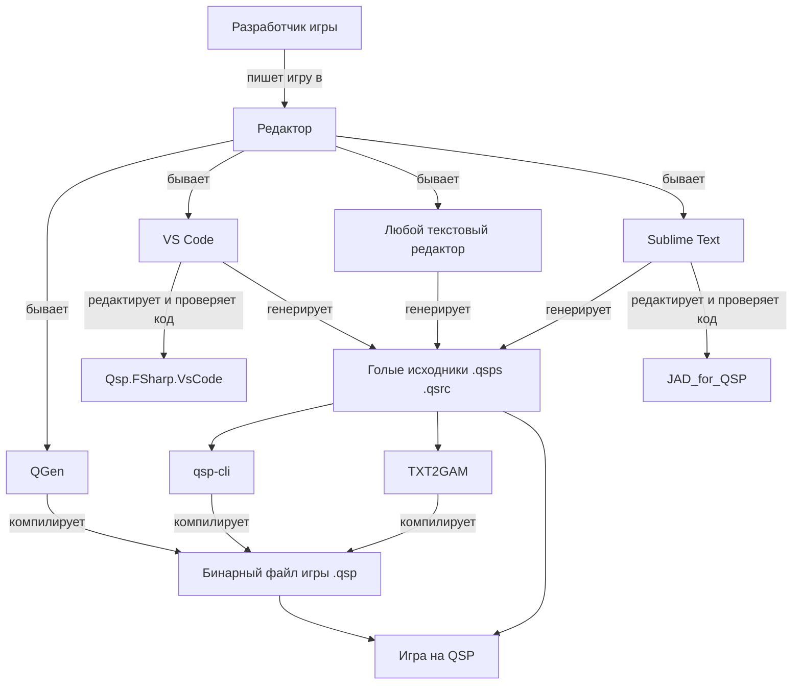
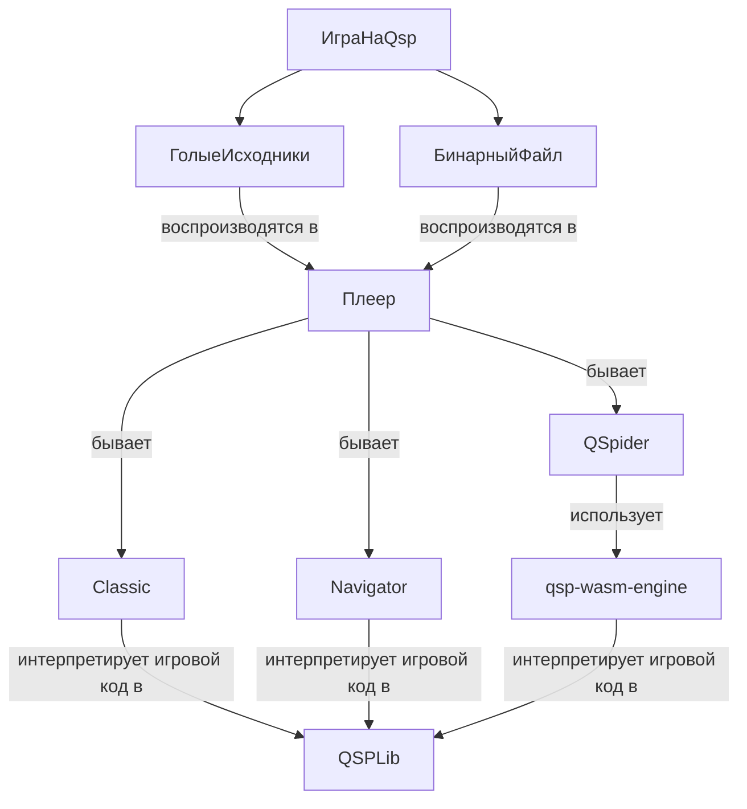
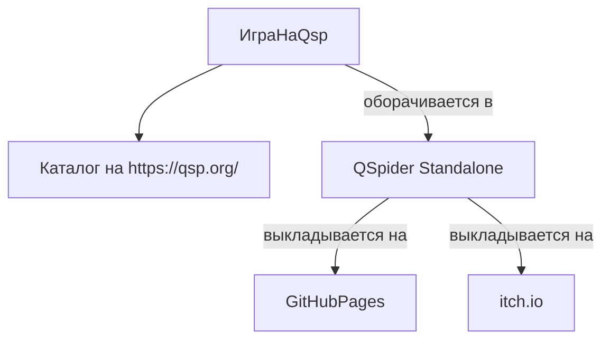

# Всё вместе

Здесь вкратце расписаны всевозможные тернистые пути от начала разработки игры на QSP (с использованием различных средств и инструментов) до ее реализации и запуска игры у конечного игрока.

## Написание игры

Разработчик игры на QSP пишет игру в:

* QGen
* редакторе

  * Sublime Text
  * VS Code
  * любой текстовый редактор

Если в Sublime Text, то при проверке кода используется расширение JAD_for_QSP

Если в VS Code, то при написании кода используется расширение Qsp.FSharp.VsCode

QGen преобразовывает исходник в бинарный файл игры

Голые исходники, написанные в редакторах, либо оставляются так, либо преобразовываются в бинарник с помощью одной из утилит:

* QSP CLI
* TXT2GAM

Некоторые утилиты позволяют преобразовать бинарные файлы игр обратно в текстовый формат.

## Воспроизведение игры

Голые исходники или бинарники воспроизводятся в плеерах:

* Classic
* Navigator
* QSpider

Classic и Navigator используют интерпретатор QSPLib.

QSpider использует qsp-wasm-engine, который является обёрткой над интерпретатором QSPLib.

## Распространение игры

В дальнейшем разработчик игры выкладывает ресурсы игры в:

* каталог QSP
* на GitHub Pages с помощью QSpider Standalone
