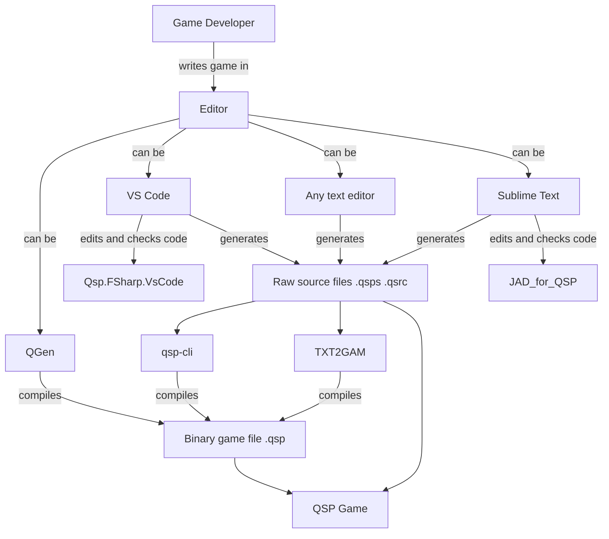
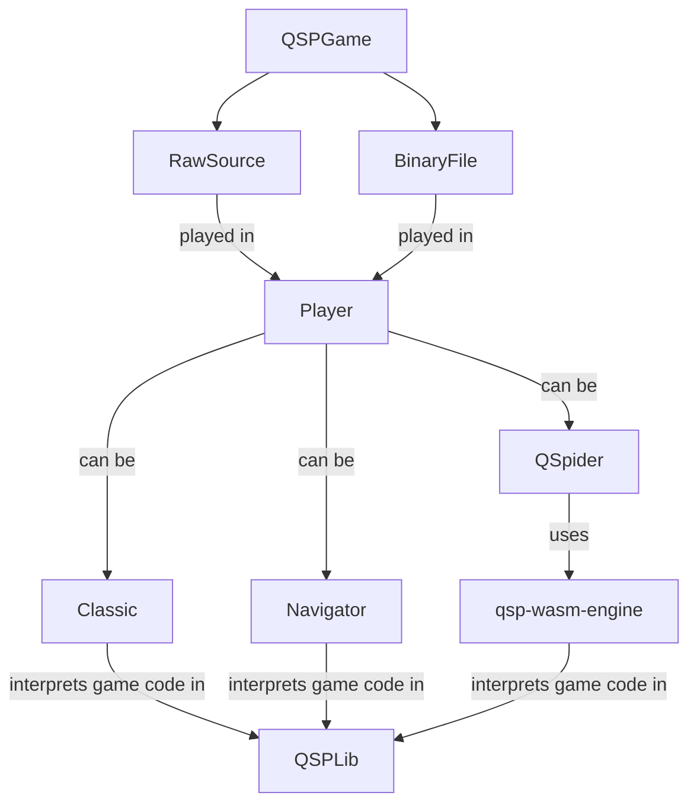
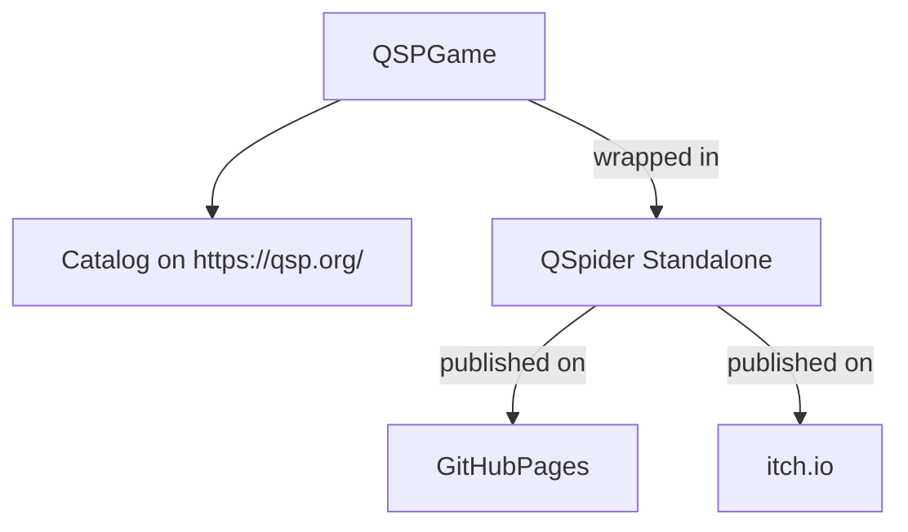

# All Together

This section briefly outlines various thorny paths from starting QSP game development (using various tools and instruments) to implementing and launching the game for the end player.

## Writing Games



QSP game developers write games in:

* QGen
* Editors
  * Sublime Text
  * VS Code
  * Any text editor

If using Sublime Text, the JAD_for_QSP extension is used for code checking.

If using VS Code, the Qsp.FSharp.VsCode extension is used when writing code.

QGen converts source code into a binary game file.

Raw source files written in editors are either left as-is or converted to binary using one of the utilities:

* QSP CLI
* TXT2GAM

Some utilities allow converting binary game files back to text format.

## Playing Games



Raw source files or binaries are played in players:

* Classic
* Navigator
* QSpider

Classic and Navigator use the QSPLib interpreter.

QSpider uses qsp-wasm-engine, which is a wrapper around the QSPLib interpreter.

## Game Distribution



Later, the game developer publishes game resources to:

* QSP catalog
* GitHub Pages using QSpider Standalone

Now the player can:

* Download the game from the [QSP catalog](https://qsp.org/index.php?option=com_sobi2&Itemid=55) and play it in players
* Launch the game with [QSpider](https://dev.qsp.org/qspider)

  There you can either:

  * Open a .qsp file from your device
  * Add a game from the library and run it
  * Run a game via direct link

    * Game from catalog

      If you know the game ID (for example, 285 — "Ballad of the Hero"), you can run it like this:

      ```text
      https://qspfoundation.github.io/qspider/?catalogId=285
      ```

    * From a separate source

      For example, there's a game "Ballad of the Hero" located at the following link:

      ```text
      https://aleksversus.github.io/QSP-storage/game/heroballad/heroballad.qsp
      ```

      This link can be loaded into QSpider:

      ```text
      https://qspfoundation.github.io/qspider/?config=https://aleksversus.github.io/QSP-storage/game/heroballad/heroballad.qsp
      ```

      And [go to it](https://qspfoundation.github.io/qspider/?config=https://aleksversus.github.io/QSP-storage/game/heroballad/heroballad.qsp)

* Go to a link on GitHub, itch.io, etc., and just start playing

The best option to make life easier for both the game developer and player is to upload the game to a website and give the player a direct link to the game. This way you can avoid +100500 problems.