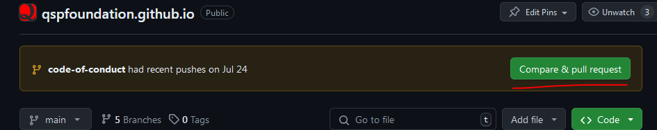
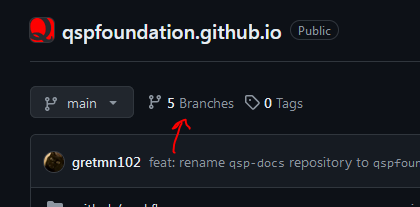
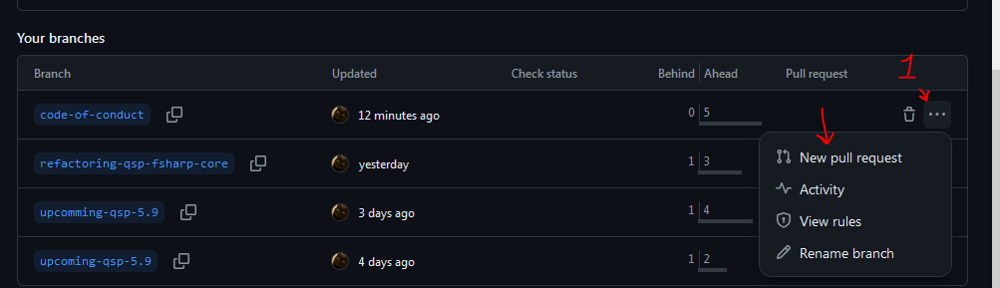

# Collaborative Development

The main purpose of collaborative development is to avoid stepping on each other's toes. To achieve this, we need to follow some rules:

* We coordinate in [#qsp_platform_dev](https://discord.com/channels/373163463842725891/749965798038306866) ([IF Discord invitation](https://discord.gg/bbbdxhE9M2)) about what we're going to write
* We don't touch the `main` branch at all
* We create and use our own branches
* We merge all branches through pull requests
* We delete our branches when they're no longer needed

## Example

For instance, someone decided to write about syntax highlighting. To do this, they need to:

* Set up the development environment:
  * Clone the repository:

    ```bash
    git clone https://github.com/QSPFoundation/qspfoundation.github.io.git
    ```

  * Go to the repository folder and install packages:

    ```bash
    cd qspfoundation.github.io
    npm install
    ```

  * Start the live server:

    ```bash
    npm run start
    ```

  * Open the link in a browser

  Now the documentation page in the browser will automatically update with every change made.

* Create a `syntax-highlight` branch

  ```bash
  git checkout -b syntax-highlight
  ```

  You can do this through your editor tools — doesn't matter.

* Create a file `docs/syntax-highlighting.md` and start writing the article in it
* Add the file to git and commit:

  ```bash
  git add docs/syntax-highlighting.md
  git commit -m "wip: I was too lazy to give it a proper name"
  ```

  You can give a meaningful message, but it doesn't always work out that way, so this is fine too. More about meaningfulness below.

* Push the branch to GitHub:

  ```bash
  git push -u origin syntax-highlight
  ```

  That's it, now the branch is there. We don't touch other people's branches, or we'll get confused.

* Continue writing the article in `docs/syntax-highlighting.md`
* Add the file changes to git and commit:

  ```bash
  git add .
  git commit -m "wip: finally finished writing the article!"
  ```

* Push:

  ```bash
  git push
  ```

* Create a pull request from this branch through GitHub:

  * Go to the creation page using one of two methods:
    * Through the main repository page:

      

    * Through branches
      * Click on [branches](https://github.com/QSPFoundation/qspfoundation.github.io/branches)

        
      * Select the branch you're interested in, click on `...` and in the dropdown menu select "New Pull Request"

        

  * Give the pull request a meaningful name in the "Add a title" field

    By meaningful name, we mean something like:

    ```bash
    docs: write the syntax highlighting article
    ```

    The repository uses a [common commit naming convention](https://www.conventionalcommits.org/en/v1.0.0/).

* As soon as the pull request is created, tests will run (they are defined in `.github/workflows/test-deploy.yml`). They will check if everything is in order with your changes

* Let people know in the IF Discord, so someone can approve your Pull Request, and wait

Once your Pull Request is approved, your branch will merge with the `main` branch, deployment will automatically start (this is configured in `.github/workflows/deploy.yml`), and after some time you'll be able to see the changes on the documentation site.

After the branch is merged, it becomes unnecessary and should be deleted so it doesn't get in the way:

* Delete the branch from GitHub:

  ```bash
  git push -d origin syntax-highlighting
  ```

* Delete the branch on your computer:

  ```bash
  git branch -d syntax-highlighting
  ```

* Delete all local branches that no longer exist on GitHub:

  ```bash
  git fetch -p && git branch -vv | awk '/: \w+]/{print $1}' | xargs git branch -d --force
  ```

## Pull Request Approval

If you have the rights, you can approve a Pull Request in three ways:

* `squash` — all commits from your branch are combined into one commit (*if you're not sure, use this method*)

  This is needed to turn this stream of consciousness:

  ```text
  wip: I was too lazy to give it a proper name
  wip: finally finished writing the article!
  ```

  Into one meaningful commit:

  ```bash
  docs: write syntax highlighting article
  ```

* `rebase` — this merges new commits into `main`

  Can be used if you have meaningful commits, like:

  ```text
  docs(syntax-highlighting): start writing an article
  docs(syntax-highlighting): write short description of what syntax highlighting is
  ...
  ```

  Then it's not embarrassing to put all this directly into `main` in this form.

* something else that merges the branch through a commit. I forgot what it's called